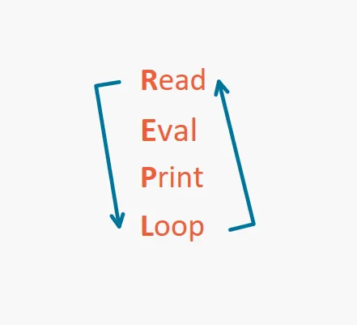
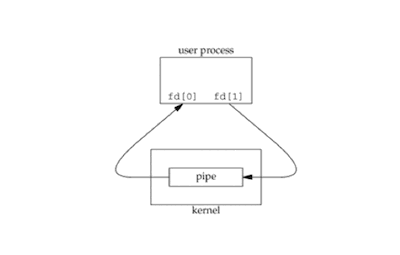

# 🐚 CppShell: A POSIX-Compliant Shell Built from Scratch

> **Build From Scratch — Season I Submission** > *A deep dive into Operating System fundamentals, Process Management, and System Calls.*

## 📖 Overview

**CppShell** is a custom command-line interpreter (shell) built entirely in C++ without relying on high-level system management libraries. 

The goal of this project was to demystify the "magic" of the terminal. Instead of using `system()`, this shell interacts directly with the Linux kernel using raw system calls to manage processes, file descriptors, and memory. It replicates the core functionality of standard shells like Bash or Zsh, including pipelines, redirections, and persistent history.

### ℹ️ Note on Repository Structure
This project was undertaken as part of the **CodeCrafters "Build Your Own Shell" Challenge**. 
* You may notice the **initial commit** was authored by the CodeCrafters bot, and the repository contains a `.codecrafters` configuration folder.
* These files provided the initial empty skeleton and testing framework.
* **All core logic, implementation, and features (parsing, process management, pipelines, etc.) were built completely on my own from scratch.**

---

## ✨ Key Features

* **REPL Architecture:** A custom Read-Eval-Print Loop that parses user input and manages the shell lifecycle.
* **Process Management:** Spawns child processes using `fork()`, `execvp()`, and `waitpid()`.
* **Multi-Stage Pipelines:** Supports infinite command chaining (e.g., `cmd1 | cmd2 | cmd3`) using raw pipes and file descriptor manipulation.
* **I/O Redirection:** Handles standard output (`>`) and standard error (`2>`) redirection, including append mode (`>>`).
* **Advanced Parsing:** Custom state-machine parser handling:
    * **Single Quotes:** Literal string interpretation.
    * **Double Quotes:** Selective escaping (`$`, `\`, `"`).
    * **Backslash Escaping:** Handling escape sequences outside and inside quotes.
* **Built-in Commands:** Custom implementations of `cd`, `pwd`, `echo`, `type`, `exit`, and `history`.
* **Persistent History:** Session history is saved to and loaded from a file (supports `HISTFILE`, `history -r`, `-w`, `-a`).
* **Auto-Completion:** Tab-completion for executables in `$PATH` and built-in commands.

---

## 🛠️ Internal Architecture

This project relies heavily on **Linux System Calls**. Below is a breakdown of the core engineering concepts implemented.

### 1. The Execution Flow
The shell operates on a continuous loop that blocks for user input, parses the string into tokens, and determines execution strategy (Builtin vs. External).



### 2. The Pipeline Logic ("The Bucket Brigade")
Pipelines are implemented by creating a chain of child processes. 
* **System Call:** `pipe(int fd[2])` creates a unidirectional data channel.
* **Wiring:** I use `dup2()` to swap the child process's **STDOUT** with the write-end of the pipe, and the next child's **STDIN** with the read-end.
* **Synchronization:** The parent process acts as an orchestrator, closing unused file descriptors to prevent deadlocks and waiting for all children to terminate.



### 3. The Custom Parser
Standard string splitting is insufficient for a shell due to nested quotes and escape characters. I built a custom **State Machine Parser** that iterates through input character-by-character, toggling flags (`in_single_quote`, `in_double_quote`) to correctly tokenize arguments.

---

## 🚀 Installation & Usage

### Prerequisites
* Linux/macOS environment
* `g++` compiler
* `libreadline` (for input handling)

### Build Steps

```bash
# 1. Clone the repository
git clone [https://github.com/yourusername/cppshell.git](https://github.com/yourusername/cppshell.git)

# 2. Compile the source code
# We link against readline for the input interface
g++ -o cppshell main.cpp -lreadline

# 3. Run the shell
./cppshell
```

### Example Usage
```bash 

# List files using the shell
$ ls -la

# Use a pipeline with a builtin
$ history | grep "echo" | wc -l

# Redirection
$ echo "Hello World" > output.txt

# Persistent History
$ history -a my_history.txt
```

## 🧠 Challenges & Learnings
**Zombie Processes & Memory Leaks**
One of the biggest challenges was managing file descriptors in multi-stage pipelines. If the parent process fails to close a pipe's write-end, the reading child process will hang indefinitely, waiting for data that will never arrive. Debugging this required a deep understanding of the pipe() lifecycle.

**The "Fork" Concept**
Understanding that fork() clones the entire process—memory, variables, and state—was a paradigm shift. Implementing execvp immediately after fork to "brain transplant" the child process was a key learning moment.

---

## 📜 License
This project is open-source and available under the MIT License.

---

Built for the Build From Scratch Hackathon Season I.